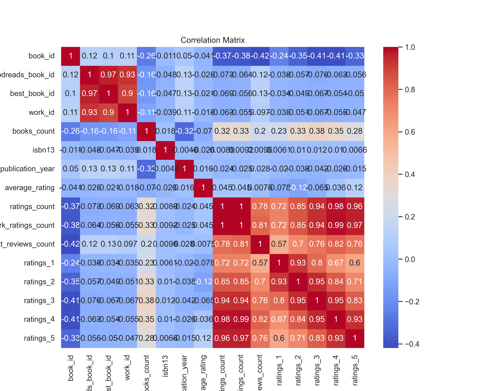

# Analysis of goodreads

## Summary
```
            book_id  goodreads_book_id  best_book_id       work_id   books_count       isbn        isbn13       authors  original_publication_year original_title           title language_code  average_rating  ratings_count  work_ratings_count  work_text_reviews_count      ratings_1      ratings_2      ratings_3     ratings_4     ratings_5                                                                                 image_url                                                                         small_image_url
count   10000.00000       1.000000e+04  1.000000e+04  1.000000e+04  10000.000000       9300  9.415000e+03         10000                9979.000000           9415           10000          8916    10000.000000   1.000000e+04        1.000000e+04             10000.000000   10000.000000   10000.000000   10000.000000  1.000000e+04  1.000000e+04                                                                                     10000                                                                                   10000
unique          NaN                NaN           NaN           NaN           NaN       9300           NaN          4664                        NaN           9274            9964            25             NaN            NaN                 NaN                      NaN            NaN            NaN            NaN           NaN           NaN                                                                                      6669                                                                                    6669
top             NaN                NaN           NaN           NaN           NaN  439023483           NaN  Stephen King                        NaN                 Selected Poems           eng             NaN            NaN                 NaN                      NaN            NaN            NaN            NaN           NaN           NaN  https://s.gr-assets.com/assets/nophoto/book/111x148-bcc042a9c91a29c1d680899eff700a03.png  https://s.gr-assets.com/assets/nophoto/book/50x75-a91bf249278a81aabab721ef782c4a74.png
freq            NaN                NaN           NaN           NaN           NaN          1           NaN            60                        NaN              5               4          6341             NaN            NaN                 NaN                      NaN            NaN            NaN            NaN           NaN           NaN                                                                                      3332                                                                                    3332
mean     5000.50000       5.264697e+06  5.471214e+06  8.646183e+06     75.712700        NaN  9.755044e+12           NaN                1981.987674            NaN             NaN           NaN        4.002191   5.400124e+04        5.968732e+04              2919.955300    1345.040600    3110.885000   11475.893800  1.996570e+04  2.378981e+04                                                                                       NaN                                                                                     NaN
std      2886.89568       7.575462e+06  7.827330e+06  1.175106e+07    170.470728        NaN  4.428619e+11           NaN                 152.576665            NaN             NaN           NaN        0.254427   1.573700e+05        1.678038e+05              6124.378132    6635.626263    9717.123578   28546.449183  5.144736e+04  7.976889e+04                                                                                       NaN                                                                                     NaN
min         1.00000       1.000000e+00  1.000000e+00  8.700000e+01      1.000000        NaN  1.951703e+08           NaN               -1750.000000            NaN             NaN           NaN        2.470000   2.716000e+03        5.510000e+03                 3.000000      11.000000      30.000000     323.000000  7.500000e+02  7.540000e+02                                                                                       NaN                                                                                     NaN
25%      2500.75000       4.627575e+04  4.791175e+04  1.008841e+06     23.000000        NaN  9.780316e+12           NaN                1990.000000            NaN             NaN           NaN        3.850000   1.356875e+04        1.543875e+04               694.000000     196.000000     656.000000    3112.000000  5.405750e+03  5.334000e+03                                                                                       NaN                                                                                     NaN
50%      5000.50000       3.949655e+05  4.251235e+05  2.719524e+06     40.000000        NaN  9.780452e+12           NaN                2004.000000            NaN             NaN           NaN        4.020000   2.115550e+04        2.383250e+04              1402.000000     391.000000    1163.000000    4894.000000  8.269500e+03  8.836000e+03                                                                                       NaN                                                                                     NaN
75%      7500.25000       9.382225e+06  9.636112e+06  1.451775e+07     67.000000        NaN  9.780831e+12           NaN                2011.000000            NaN             NaN           NaN        4.180000   4.105350e+04        4.591500e+04              2744.250000     885.000000    2353.250000    9287.000000  1.602350e+04  1.730450e+04                                                                                       NaN                                                                                     NaN
max     10000.00000       3.328864e+07  3.553423e+07  5.639960e+07   3455.000000        NaN  9.790008e+12           NaN                2017.000000            NaN             NaN           NaN        4.820000   4.780653e+06        4.942365e+06            155254.000000  456191.000000  436802.000000  793319.000000  1.481305e+06  3.011543e+06                                                                                       NaN                                                                                     NaN
```

## Narrative
Based on the provided dataset summary and statistics, here are some key insights and potential actions:

### Key Insights:

1. **Data Composition**:
   - The dataset consists of 10,000 rows with information about books, such as their IDs, authors, ratings, publication years, and imagery.
   - There are several columns indicating the number of ratings received (from 1 to 5 stars) and total ratings, which are essential for understanding books' popularity.

2. **Author Popularity**:
   - The most frequent author in the dataset is Stephen King, appearing 60 times. This suggests he is a prominent figure in this collection, warranting further exploration into his works.

3. **Publication Year**:
   - The publication years range from -1750 (which could indicate erroneous data entries) to 2017, with a mean of approximately 1982. This indicates a wide variety of books, including both classics and contemporary works.

4. **Average Ratings**:
   - The `average_rating` column has a mean of approximately 4.00, with a standard deviation of 0.25. This is a positive reflection on overall book quality in the dataset, but also indicates variability among book ratings.

5. **Ratings Count**:
   - There is a high mean and variance in the `ratings_count` and `work_ratings_count` (e.g., mean ratings count is around 54,000), indicating some books are far more popular than others. This highlights the presence of outliers or bestsellers within the dataset.

6. **Language Distribution**:
   - The majority of books are in English (language code "eng"). The dataset may need further investigation to analyze authors and books in other languages if that information is present.

7. **ISBNs and Identifiers**:
   - The dataset includes ISBNs and ISBN13s, which can be used to cross-reference books in external databases for further insights or data completeness.

### Potential Actions:

1. **Data Cleaning**:
   - Inspect and correct anomalies such as the extremely early publication year (-1750).
   - Investigate and clean any erroneous isbn or isbn13 values, as these are critical for uniquely identifying each book.

2. **Content Analysis**:
   - Analyze ratings and reviews to determine which attributes contribute to higher average ratings. This can inform authors and publishers on factors that resonate with readers.

3. **Popularity Assessment**:
   - Identify a list



