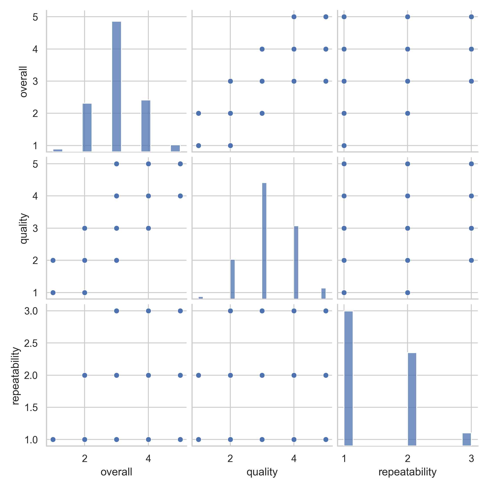
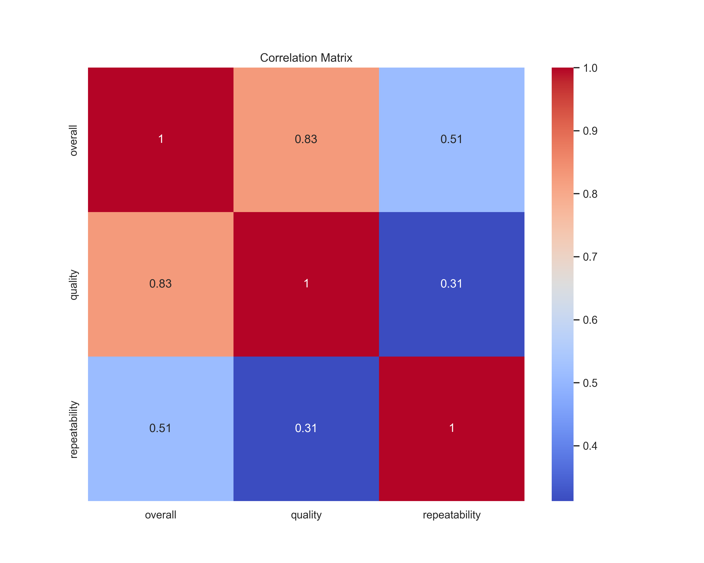

# Analysis of media

## Summary
```
             date language   type              title                 by      overall      quality  repeatability
count        2553     2652   2652               2652               2390  2652.000000  2652.000000    2652.000000
unique       2055       11      8               2312               1528          NaN          NaN            NaN
top     21-May-06  English  movie  Kanda Naal Mudhal  Kiefer Sutherland          NaN          NaN            NaN
freq            8     1306   2211                  9                 48          NaN          NaN            NaN
mean          NaN      NaN    NaN                NaN                NaN     3.047511     3.209276       1.494721
std           NaN      NaN    NaN                NaN                NaN     0.762180     0.796743       0.598289
min           NaN      NaN    NaN                NaN                NaN     1.000000     1.000000       1.000000
25%           NaN      NaN    NaN                NaN                NaN     3.000000     3.000000       1.000000
50%           NaN      NaN    NaN                NaN                NaN     3.000000     3.000000       1.000000
75%           NaN      NaN    NaN                NaN                NaN     3.000000     4.000000       2.000000
max           NaN      NaN    NaN                NaN                NaN     5.000000     5.000000       3.000000
```

## Narrative
Based on the information provided about the dataset, here is an analysis of the key insights and potential actions that you might consider:

### Dataset Overview
- **Size**: The dataset consists of 2,652 rows and 8 columns.
- **Date**: The 'date' column has 2,055 unique dates, suggesting a wide range of entries across time.
- **Language**: There are 11 unique languages, with English being the most common (1,306 occurrences).
- **Type**: There are 8 unique types (likely indicating different categories like movie, series, etc.), with 'movie' being the most frequent (2,211 occurrences).
- **Title & By**: The number of unique titles is 2,312, indicating many distinct entries, with 'Kanda Naal Mudhal' as the most frequently cited title (9 occurrences). There are 1,528 unique contributors or creators.
  
### Summary Statistics
- **Overall Ratings**: The average overall rating is approximately 3.05 with a standard deviation of 0.76. The ratings range from 1 to 5, indicating that there are both very low and high ratings.
- **Quality Ratings**: The average quality rating is slightly higher at about 3.21, suggesting participants generally find quality to be good, but still has some variability (standard deviation of 0.80).
- **Repeatability Ratings**: The average repeatability rating is lower at approximately 1.49, with a maximum of only 3, indicating that subjects are generally not considered very repeatable. 

### Key Insights
1. **Distribution of Ratings**: The distribution of the 'overall' ratings appears centered around 3, with most entries receiving average scores. This could be seen as a signal of moderate satisfaction.
   
2. **Quality vs. Overall Ratings**: Quality ratings are slightly higher than overall ratings, suggesting that while the quality might be perceived positively, it does not always translate to an overall positive experience or engagement from the audience.
   
3. **Low Repeatability**: The average repeatability score of 1.49 raises concerns, implying that the content is generally not perceived as engaging enough to warrant multiple views or interactions.

4. **Language and Type**: The dominance of English-language entries and the prevalence of the 'movie' type suggest a potential focus area for analysis and further content curation.

### Potential Actions
1. **Content Improvement



